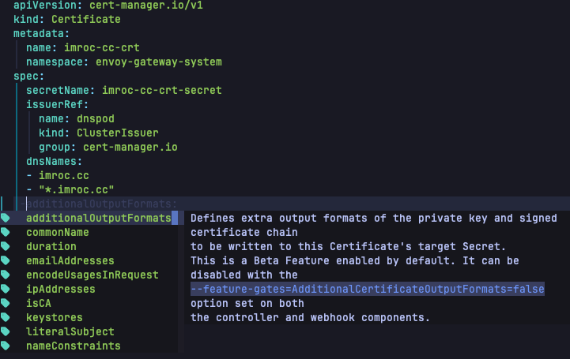

# kubenretes.nvim

Kubernetes Schema Support for Neovim.

## Screenshots

Auto completion with kubernetes resources:


Auto completion with kubernetes custom resources:



Hover over the field to expand the explanation (usually press `K`):


## Installation

`neovim/nvim-lspconfig` MUST be installed, and `yamlls`'s `on_attach` MUST call `kubernetes.nvim`'s `on_attach` function.

Install the plugin with your package manager.

Use [lazy.nvim](https://github.com/folke/lazy.nvim):

```lua
{
  "neovim/nvim-lspconfig",
  dependencies = {
    {
      "imroc/kubernetes.nvim",
    },
  },
  opts = {
    servers = {
      yamlls = {
        on_attach = function(client, bufnr)
          -- lazy load on_attach in kubernetes.nvim
          require("kubernetes").on_attach(client, bufnr)
          -- you can add other customized on_attach logic below if you want
        end,
      },
    },
  },
}
```

##  Configuration

```lua
{
  schema = { -- default schema
    url = "https://github.com/imroc/kubeschemas",
    dir = vim.fn.stdpath("data") .. "/kubernetes/schemas",
  },
  extra_schema = { -- extra schema
    url = "",
    dir = vim.fn.stdpath("data") .. "/kubernetes/extra_schemas", -- extra schema dir, `KubeSchemaDump` command will dump json schema to this dir, and have higher priority in schema match
  }
}
```

> kubernetes json schema file is generated by [kubeschema](https://github.com/imroc/kubeschema).

## Command

- `KubeSchemaDump`: Dump kubernetes json schema from current cluster (Require [kubectl](https://kubernetes.io/docs/tasks/tools/#kubectl) and [kubeschema](https://github.com/imroc/kubeschema) installed and can operate the current cluster).
- `KubeSchemaUpdate`: Update kubernetes json schema from remote git repo (Require `git` installed).

## How it works

Dynamically parse the `kind` and `apiVersion` fields in the YAML file content to locate the corresponding JSON schema file and pass it to `yamlls`, thereby enabling automatic completion, validation, and field explanation hints for Kubernetes YAML.

This approach has the following advantages:
1. **High performance**. Precise matching of small JSON schemas means yamlls does not need to traverse all the schemas during matching.
2. **Extremely extensible**. Each kubernetes resource type have a corresponding json schema file, one subdirectory per group, allowing for unlimited expansion of additional kubernetes resource types.
